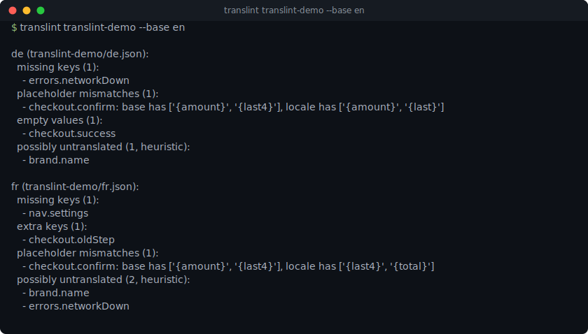
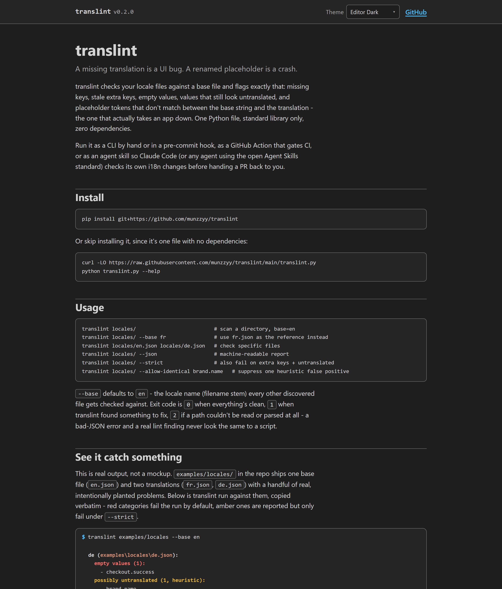

# translint

**A missing translation is a UI bug. A renamed placeholder is a crash.** translint checks
your locale files against a base and flags exactly that: missing keys, stale extra keys,
empty values, values that still look untranslated, and the one that actually takes an app
down — placeholder tokens that don't match between the base string and the translation.

[](https://github.com/munzzyy/translint/actions/workflows/ci.yml)
[](https://pypi.org/project/translint/)
[](LICENSE)




Four ways to use it: see it run in the [browser demo](https://munzzyy.github.io/translint/),
run the CLI by hand or in a pre-commit hook, gate CI with the GitHub Action, or install it as
a skill so your AI coding agent checks its own i18n changes before handing them back to you.
One Python file, standard library only, no dependencies.

**[Try it in your browser](https://munzzyy.github.io/translint/).** Real output from the
bundled example locale files, not a mockup - nine themes, works on a phone, nothing leaves
your machine. A linter for translations should practice what it lints, so the site itself
reads in 32 languages, right-to-left included - pick yours from the header.

[](https://munzzyy.github.io/translint/)

## Example

Three locale files, one base:

```
examples/locales/en.json   (base)
examples/locales/fr.json
examples/locales/de.json
```

`fr.json` is missing `nav.settings`, has a leftover `checkout.oldStep` key from an old
checkout flow, renamed `{amount}` to `{total}` in a translated string, and left an error
message in English. `de.json` shipped `checkout.success` as an empty string:

```
$ translint examples/locales --base en
de (examples\locales\de.json):
  empty values (1):
    - checkout.success
  possibly untranslated (1, heuristic):
    - brand.name

fr (examples\locales\fr.json):
  missing keys (1):
    - nav.settings
  extra keys (1):
    - checkout.oldStep
  placeholder mismatches (1):
    - checkout.confirm: base has ['{amount}', '{last4}'], locale has ['{last4}', '{total}']
  possibly untranslated (2, heuristic):
    - brand.name
    - errors.networkDown
$ echo $?
1
```

`brand.name` ("Acme") shows up as "possibly untranslated" in both locales because it's
byte-identical to the base value - correctly so, since it's a brand name that should stay
the same everywhere. That's the heuristic working, and it's also exactly what
`--allow-identical brand.name` is for (see [Config](#config)).

The one that matters most is `checkout.confirm`: the base string interpolates
`{amount}` and `{last4}`, but the French translation interpolates `{total}` and
`{last4}` - `{amount}` never got translated in, `{total}` isn't a placeholder the code
knows about. That code renders fine in every test that doesn't pass real interpolation
data, and throws the moment it does.

## As an agent skill

Point your coding agent at translint and it'll check its own i18n changes before handing
a PR back to you. Two install paths, pick whichever your agent supports:

```bash
# Claude Code
/plugin marketplace add munzzyy/translint
/plugin install translint@translint

# any agent using the open Agent Skills standard (Codex, Cursor, and others)
npx skills add munzzyy/translint
```

Either way, the agent gets [SKILL.md](skills/translint/SKILL.md): when to run it (after
adding or editing locale keys, before finalizing an i18n PR) and how to read the result.
Ask the agent something like "check the locale files before you finish this PR" and it'll
run `translint.py --json` on the locale directory and act on what comes back.

## Install

```bash
pip install translint
```

Or skip the install entirely, since it's a single file with no dependencies:

```bash
curl -LO https://raw.githubusercontent.com/munzzyy/translint/main/translint.py
python translint.py --help
```

## Usage

```bash
translint locales/                          # scan a directory, base=en
translint locales/ --base fr                # use fr.json as the reference instead
translint locales/en.json locales/de.json   # check specific files
translint locales/ --json                   # machine-readable report
translint locales/ --strict                 # also fail on extra keys + untranslated
translint locales/ --allow-identical brand.name   # suppress one heuristic false positive
translint locales/*.json --base en          # globs work even on Windows shells
```

`--base` (default `en`) is the locale name - the filename stem, so `en` means `en.json`,
`en.po`, or `en.properties`, whichever is present - that every other discovered locale
file gets checked against. Point translint at a directory and it scans every file with a
recognized extension (non-recursive); point it at specific files and it checks exactly
those.

Exit code is 0 when every locale is clean, 1 when translint found something to fix, and 2
if a path couldn't be read or parsed at all - a bad-JSON error and a real lint finding
never look the same to a script. By default only missing keys, placeholder mismatches,
and empty values fail the run; extra keys and untranslated-value heuristic hits are
reported but don't fail unless you pass `--strict` - both are far more likely to have a
legitimate explanation (a key mid-removal, a brand name) than the other three.

## Formats

Auto-detected by extension, or forced with `--format {json,po,properties}`:

- **JSON** - both nested objects (`{"app": {"title": "..."}}`) and flat dot-namespaced
  keys (`{"app.title": "..."}`) are supported; nested files get flattened to dotted keys
  for comparison, so a nested base and a flat translation (or vice versa) still compare
  correctly key-for-key.
- **gettext .po / .pot** - `msgid`/`msgstr` pairs, multi-line strings, and plural forms
  (`msgstr[0]` is compared against `msgid` the same way a singular translation would be;
  `msgstr[1..]` are the plural variants and aren't diffed against the singular `msgid`).
  No `polib` dependency - it's plain text parsing plus `json.loads` for unescaping the
  quoted string literals, since `.po`'s C-style escaping is a subset of JSON's.
- **Java .properties** - `key=value` or `key:value`, comments (`#`/`!`), and backslash
  line continuations.

## Placeholder styles

translint detects five interpolation styles and diffs the tokens as a multiset. A
translation that uses a placeholder twice when the base only uses it once still counts as
a mismatch - comparing token sets alone would let that slip through:

| Style | Example | Common in |
|---|---|---|
| `{name}` | `Hello {name}` | ICU, i18next, Python `str.format` |
| `{{name}}` | `Hello {{name}}` | Handlebars, Vue, Mustache |
| `%s` / `%d` / `%1$s` | `Hello %s` | printf, gettext, Java positional |
| `%(name)s` | `Hello %(name)s` | Python `%`-format |
| `${name}` / `$name` | `Hello ${name}` | shell, template literals |

A value can mix styles (rare, but not invalid) and every token from every style that
matched gets included in the comparison. A value with no placeholder syntax at all
correctly matches another value with none - most short UI strings never had a placeholder
to begin with, and that's not a bug.

## Config

Command-line flags for one-off runs, or drop a `.translintrc.json` next to your locale
files for anything that should persist:

```json
{
  "allow_identical": ["brand.name", "app.title.wordmark"],
  "do_not_translate": ["Acme", "kg", "kWh"]
}
```

- `allow_identical` - key names exempt from the untranslated-value heuristic entirely.
  Use this for a specific key that legitimately renders the same in every locale (a brand
  name split across markup, a deliberate loanword, a genuine cross-language cognate).
- `do_not_translate` - substrings stripped from both the base and translated value before
  the untranslated check compares them. Use this for a token that shows up inside
  otherwise-real prose across many keys (a product name, a unit symbol) so a string that's
  genuinely translated except for that one repeated token doesn't false-positive.

Both are also available as repeatable flags (`--allow-identical KEY`,
`--do-not-translate TOKEN`) if you'd rather not commit a config file. translint looks for
`.translintrc.json` in the directory you point it at; pass `--config PATH` to use a
specific file instead.

## The untranslated-value check, honestly

This one's a **heuristic**, not a hard rule, and the CLI output says so. translint strips
placeholders, punctuation, numbers, and any configured `do_not_translate` tokens from both
the base and the translated value, then flags the key if what's left is identical - and
only if the base's remaining content has at least 3 letters, so a value that's just a unit
symbol or a bare number doesn't flag in every locale it's legitimately identical in
(`"kg"` staying `"kg"` in French isn't a missed translation).

A hit means "this looks untranslated," not "this is definitely wrong." Brand names,
loanwords, and real cross-language cognates all trip it correctly and aren't bugs - that's
what `--allow-identical` and `--do-not-translate` are for. Silence a hit that way, not by
ignoring the finding, so the check stays useful for the next change instead of turning
into noise you've trained yourself to skim past.

## As a pre-commit hook

```yaml
repos:
  - repo: https://github.com/munzzyy/translint
    rev: v0.4.0
    hooks:
      - id: translint
        args: [locales/, --base, en]
```

The hook always passes the full path you configure in `args`, not just the files that
changed in that commit (`pass_filenames: false`) - missing-key detection needs to see
every locale file at once, so a partial file list from a commit that only touched one
locale would make the comparison meaningless.

## As a GitHub Action

```yaml
- uses: munzzyy/translint@v0.4.0
  with:
    paths: locales/
    base: en
    strict: "true"
```

Fails the job the same way the CLI's exit code does. `strict: "true"` also fails on extra
keys and untranslated-value hits, not just missing keys/mismatches/empty values.

## What it does NOT do

- **No YAML.** YAML locale files (common in Rails, Symfony, some JS i18n setups) aren't
  supported. Parsing YAML safely needs a dependency (PyYAML, or hand-rolling just enough
  of the spec to be dangerous), and translint's whole point is zero runtime dependencies.
  It's a real gap, not an oversight - if enough projects need it, a `--format yaml` behind
  an optional dependency is the likely shape, but it's not in this version.
- **The untranslated-value check is a heuristic**, covered honestly above. It flags what
  looks untranslated; it doesn't prove anything, and legitimate identical values need an
  allowlist entry, same as any linter's suppression comment.
- **It doesn't translate anything.** translint tells you what's missing or broken. Writing
  the actual translation is still your job (or your translator's, or your agent's, but
  translint isn't going to guess at one).
- **It doesn't validate translation quality.** A translation that's grammatically wrong,
  culturally off, or just bad prose passes every check here as long as the keys, tokens,
  and non-empty-ness line up. That's a different problem than the one this tool solves.
- **Non-recursive directory scan.** Pointing translint at a directory checks the files
  directly inside it, not subdirectories. Locale directories are conventionally flat; list
  files explicitly if yours isn't.

## License

MIT — free to use, change, and ship, commercial or not. See [LICENSE](LICENSE).

## Support

If translint caught a broken locale before your users saw it, [sponsoring](https://github.com/sponsors/munzzyy) is what keeps it maintained.